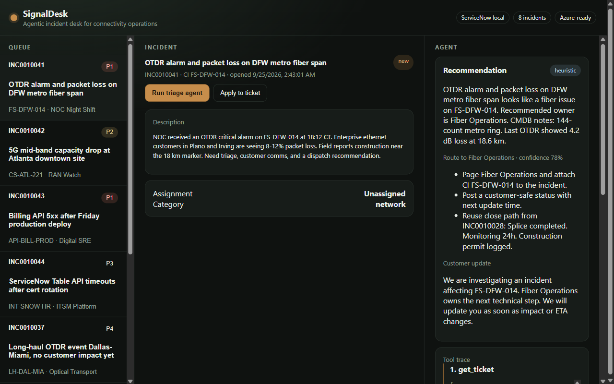

# SignalDesk

An incident desk for network and IT operations. An AI agent reads a ticket, looks up the affected system, finds similar past incidents, and recommends who should own it and what to do next. The recommendation is written back to the ticket through a **ServiceNow-compatible Table API**.



**Live demo:** _coming soon_

## What it does

1. An operator picks an incident from the queue, for example a fiber span alarm causing packet loss.
2. **Run triage agent** calls a fixed set of tools: fetch the ticket, look up the configuration item (CI) in the CMDB, search similar incidents, and list assignment groups.
3. The agent writes a recommendation: owner group, priority, next actions, and a customer-safe status update. The full tool trace is shown, so every decision is explainable.
4. **Apply to ticket** writes the category, priority, assignment group, and work notes back through the ServiceNow adapter.

On the seeded fiber outage, the agent routes to Fiber Operations and reuses the fix from a resolved incident on the same fiber span.

## Tech stack

| Area | Details |
| --- | --- |
| Backend | Python, FastAPI, SQLAlchemy, Pydantic |
| Agent | Tool-calling orchestrator with Azure OpenAI synthesis and a deterministic fallback |
| Integrations | ServiceNow Table API shape (`/api/now/table/incident`), switchable to a real instance |
| Frontend | Served HTML/JS desk, plus a React + TypeScript (Vite) version in `frontend/` |
| Infra | Docker, Docker Compose, Azure Container Apps (Bicep), Render |
| Testing | pytest covering the API, agent routing, and ServiceNow endpoints |

## Architecture

```
Desk UI  →  FastAPI  →  Agent orchestrator
               │              ├─ get_ticket
               │              ├─ lookup_asset (CMDB)
               │              ├─ search_similar_incidents
               │              ├─ list_assignment_groups
               │              └─ Azure OpenAI or heuristic synthesizer
               └─ ServiceNowAdapter (local SQL store or remote Table API)
```

Design choices:

- **Tools first, then the model.** The agent gathers context through bounded tool calls before writing a recommendation. This keeps outputs grounded and makes each run auditable.
- **Adapter boundary.** The desk only talks to `ServiceNowAdapter`. Setting `SERVICENOW_*` env vars points it at a real instance without changing the UI or the agent.
- **Graceful degradation.** Without Azure OpenAI credentials, or if the model call fails, a deterministic synthesizer produces the recommendation from the same tool outputs.

## Run locally

Requires Python 3.11+.

```powershell
cd backend
python -m venv .venv
.\.venv\Scripts\Activate.ps1
pip install -r requirements.txt
uvicorn app.main:app --reload --port 8000
```

Open [http://localhost:8000](http://localhost:8000). Interactive API docs are at [http://localhost:8000/docs](http://localhost:8000/docs).

No cloud keys are required. The database seeds itself with sample incidents on first start.

Optional React frontend (Node 20+):

```powershell
cd frontend
npm install
npm run dev
```

### Azure OpenAI (optional)

Copy `.env.example` to `backend/.env` and set the `AZURE_OPENAI_*` values. The orchestrator will use the model to write recommendations from the same tool outputs.

### Tests

```powershell
cd backend
pytest
```

## Deploy

- **Render:** `render.yaml` defines a free web service. Create a Blueprint from this repo.
- **Docker:** `docker compose up --build` runs the API and the React frontend.
- **Azure:** `infra/main.bicep` provisions Azure Container Apps with Log Analytics.

## Roadmap

- Evaluation set of labeled incidents to measure routing accuracy
- Azure SQL persistence and pagination
- Authentication for the API
- Connecting a ServiceNow developer instance
